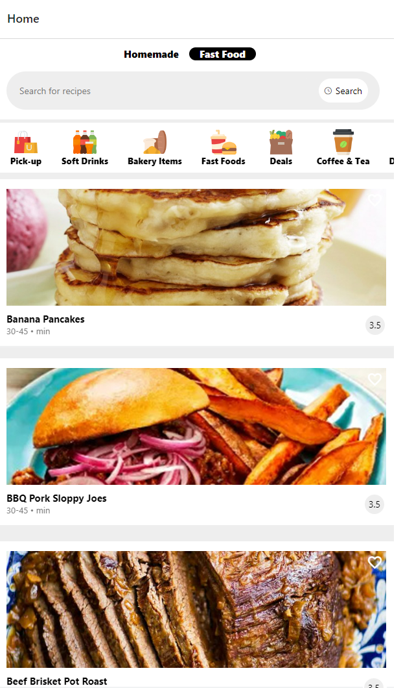
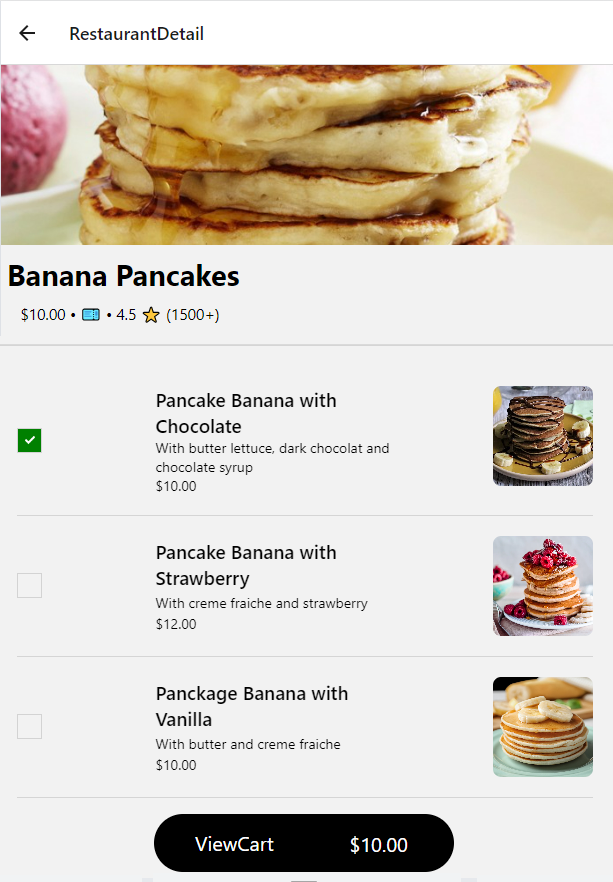

# AppStore
Mobile Application Using React Native , Firebase , Redux Toolkit

# PreRequisites : 
install React native 
install firebase 
install redux toolkit
install navigation
install react-native-vector-icons
install LottieView
install react-native-bouncy-checkbox

The API used for data is 'https://www.themealdb.com/api'

Concept : 
the app displays the recipes according to countries so by default it is set to 'American', you can change it using the search bar;
Once you click on the recipe it takes you the details page where you can place your order by selecting one or more recipe , and
when you re done you can click 'view cart' to display your order's details and confirm it . When you confirm your order it is recorded 
in firbase using firestore

 

