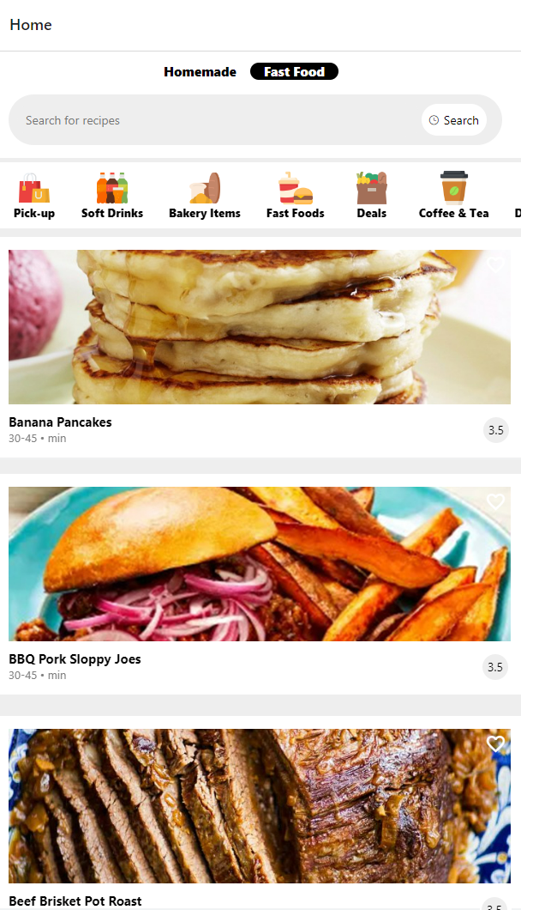
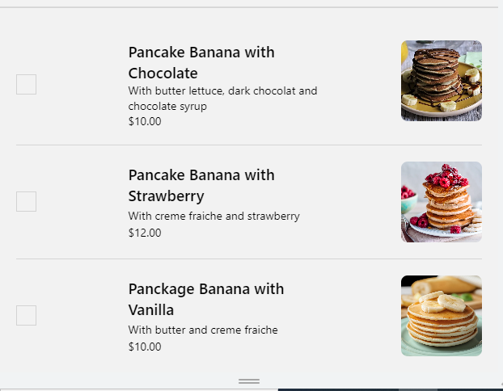
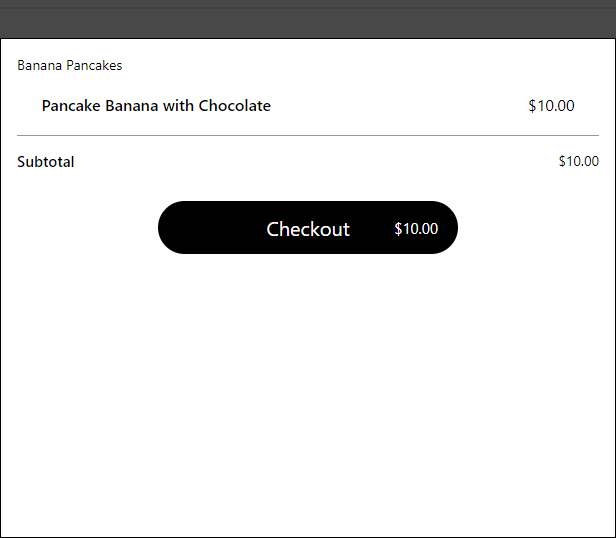
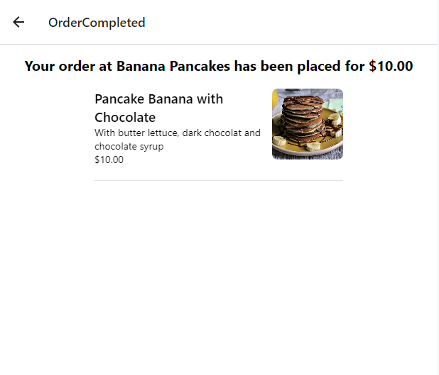
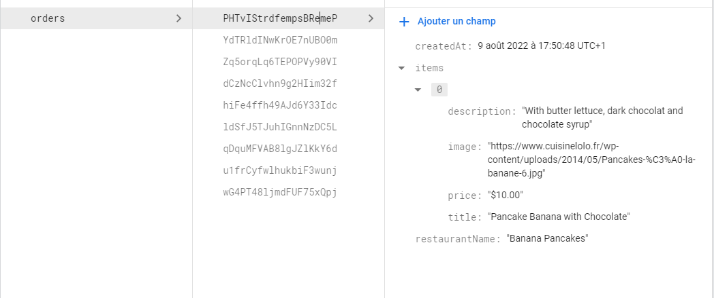

# AppStore
Mobile Application Using React Native , Firebase , Redux Toolkit

#PreRequisites : 
install React native 
install firebase 
install redux toolkit
install navigation
install react-native-vector-icons
install LottieView
install react-native-bouncy-checkbox

The API used for data is 'https://www.themealdb.com/api'

#Concept : 
the app displays the recipes according to countries so by default it is set to 'American', you can change it using the search bar;
Once you click on the recipe it takes you the details page where you can place your order by selecting one or more recipe , and
of course while you are navigating everything you select will be saved thanks to redux store, so that when you are done you check what
you have selected and confirm your order . When you confirm your order it is recorded in Firebse using firestore.

Home           |  Details
:-------------:|:------------------:
  |  

Place Order         |  Order Details     
:------------------:|:------------------:
  |  

Order Completed          |  Saved Order 
:-----------------------:|:------------------:
  |  

